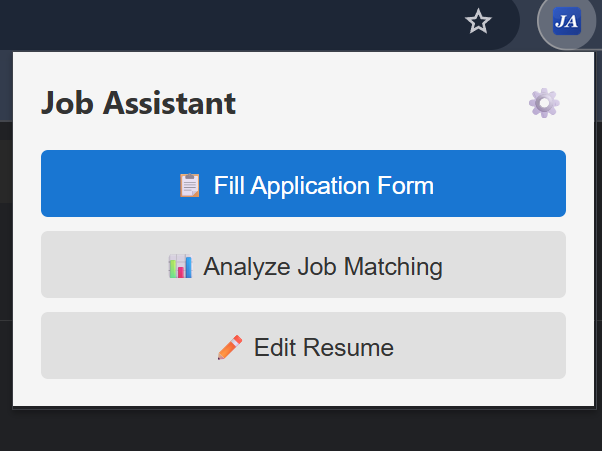
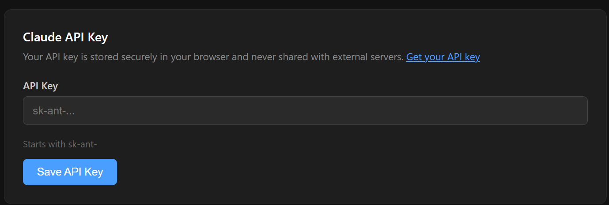
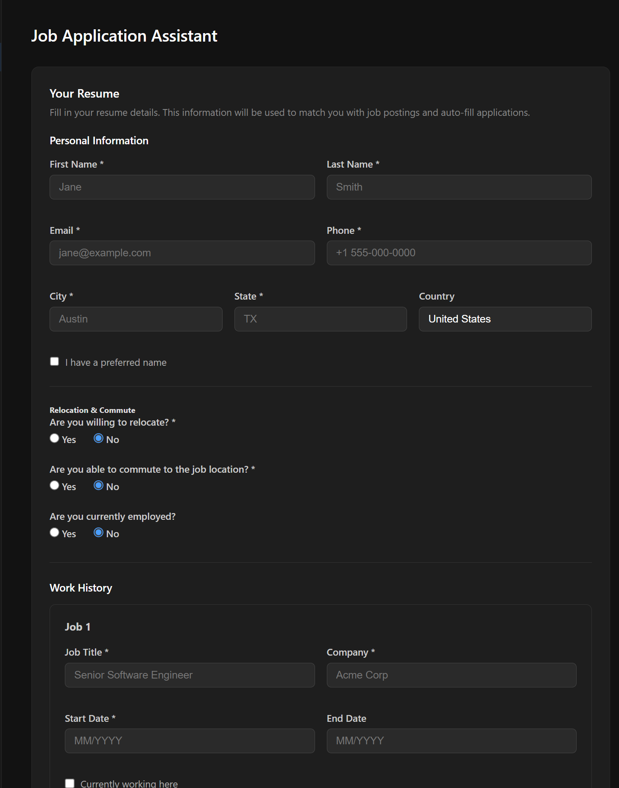
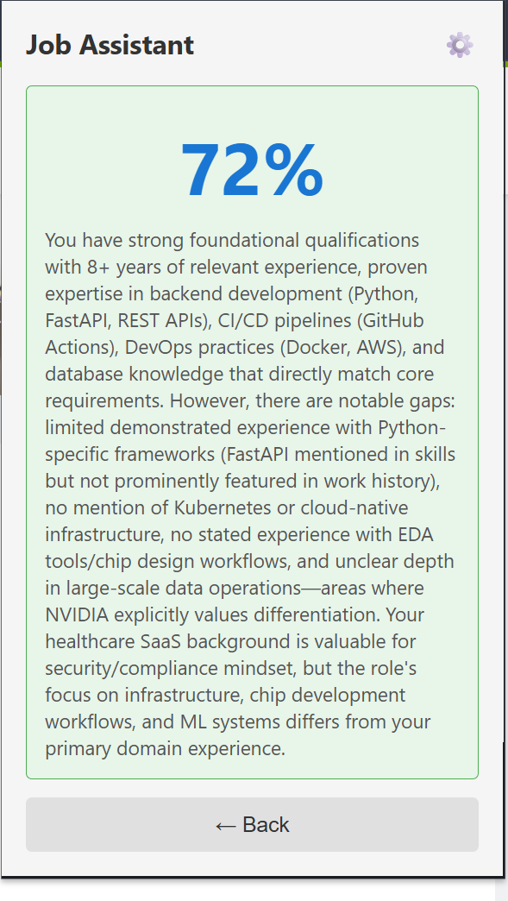
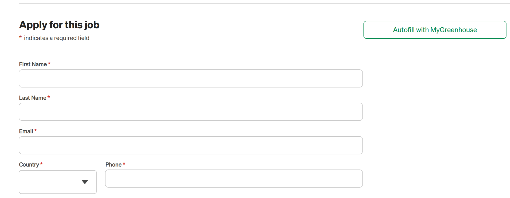
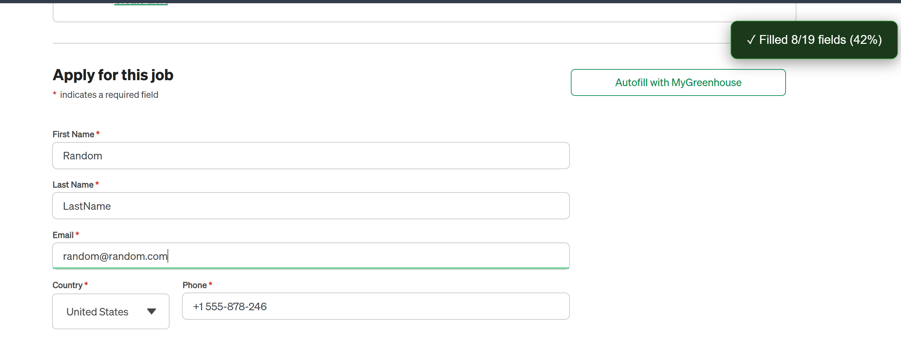

# Job Application Assistant

A Chrome extension that automatically fills job application forms using your saved resume and Claude AI — so you spend less time copy-pasting and more time getting interviews.

---

## Features

- **Auto-fills application forms** — detects form fields and fills them from your saved resume with no copy-pasting
- **AI-powered answers** — uses Claude AI to intelligently answer open-ended questions (e.g. "Why do you want to work here?")
- **Works across major job boards** — LinkedIn, Indeed, Lever, Ashby, Greenhouse, Workday, Pinpoint HQ
- **One-time setup** — enter your resume once in Settings; it's stored locally in your browser and never shared
- **Application log** — tracks every form submission with job title, company, board type, and a field-by-field breakdown
- **Privacy first** — your resume data stays in your browser; only open-ended question text is sent to the Claude AI API

---

## Installation

### Option A — Chrome Web Store *(coming soon)*

> A one-click install link will appear here once the extension is published.

---

### Option B — Install from Source

This takes about 5 minutes. You'll download the code and load it into Chrome manually.

#### Step 1 — Install required tools

You'll need two free programs. If you already have them, skip ahead.

**Git** — used to download the code from GitHub
- [Download Git](https://git-scm.com/downloads) → click the button for your operating system → run the installer with all default settings

**Node.js** — used to build the extension
- [Download Node.js](https://nodejs.org) → download the **LTS** version → run the installer with all default settings

After installing, **restart your terminal or command prompt**.

> **What is a terminal?** On Windows: press `Win + R`, type `cmd`, and press Enter.

#### Step 2 — Download the code

In your terminal, run these two commands one at a time:

```bash
git clone git@github.com:neetigya/job-application-assistant.git
cd job-application-assistant
```

This downloads the project into a folder on your computer.

#### Step 3 — Build the extension

Still in the terminal, run:

```bash
npm install
npm run build
```

- `npm install` downloads the dependencies (only needed once)
- `npm run build` compiles the code and creates a `dist/` folder

#### Step 4 — Load into Chrome

1. Open Chrome and paste this into the address bar: `chrome://extensions`
2. Turn on **Developer mode** using the toggle in the top-right corner
3. Click **Load unpacked**
4. Navigate to the project folder you downloaded and select the **`dist`** folder inside it

The extension icon will appear in your Chrome toolbar. You may need to click the puzzle-piece icon to pin it.

> **After any updates:** re-run `npm run build`, then go back to `chrome://extensions` and click the refresh icon on the extension card.

---

## Setup

### 1. Get a Claude API Key

This extension uses Claude AI (by Anthropic) to answer open-ended questions on application forms.

1. Create a free account at [console.anthropic.com](https://console.anthropic.com)
2. Go to **API Keys** in the left menu and click **Create Key**
3. Copy the key — it starts with `sk-ant-`

> Keep your API key private. Never commit it to GitHub or share it publicly.

### 2. Open Settings

Click the extension icon in your Chrome toolbar, then click the **Settings** button.



> Alternatively: go to `chrome://extensions` → find Job Application Assistant → click **Details** → click **Extension options**

### 3. Enter Your API Key

Scroll to the **API Key** section, paste your `sk-ant-...` key, and click **Save API Key**.



### 4. Fill In Your Resume

Scroll to the **Resume** section and fill in your details:

| Section | What to enter |
|---|---|
| Personal Info | Name, email, phone, city, state |
| Work History | Each job: title, company, dates, description, achievements |
| Education | School, degree, field of study, graduation date |
| Skills | Backend, frontend, databases, DevOps, other |
| Profile Summary | 2–4 sentences describing your background |
| Online Presence | GitHub, LinkedIn, portfolio URL |
| Common Questions | Expected salary, notice period, willing to travel |

Click **Save Resume** when done. Your data is stored locally in your browser.



---

## How to Use

1. **Go to a job application page** on any supported site (LinkedIn, Indeed, Lever, Ashby, Greenhouse, Workday)

2. **Click the extension icon** — it detects the page and shows three options:
   - **Fill Application** — auto-fills the form with your resume data and AI-generated answers
   - **Analyze Job Matching** — scores how well your resume matches the job posting
   - **Edit Resume** — opens your resume settings in case you want to update anything

3. **(Optional) Check job matching** — click **Analyze Job Matching** to see a match score and detailed feedback on how your background aligns with the role. This helps you decide if it's worth applying.

   

4. **Fill the application** — click **Fill Application** and the extension scans the form, matches fields to your resume data, and fills them in. Open-ended questions are answered by Claude AI based on the job description and your profile.

   

5. **Review the results** — the extension fills the form and shows a notification (top-right) with the success rate (e.g., "✓ Filled 8/19 fields (42%)"). Check the filled fields before submitting. AI-generated answers are a strong starting point but may need a personal touch for a specific role.

   

6. **View your log** — in Settings, scroll to the **Application Log** section to see every application the extension has touched, with a success rate per form.

---

## Roadmap

- [ ] Chrome Web Store listing
- [ ] Support for more job boards (Workable, iCIMS, Taleo, SmartRecruiters, BambooHR)
- [ ] Resume–job match score before applying
- [ ] Cover letter generation
- [ ] Application tracker dashboard

---

## License

MIT © 2026 [Neetigya Saxena](https://neetigya.dev)  
See [LICENSE](./LICENSE) for full terms.